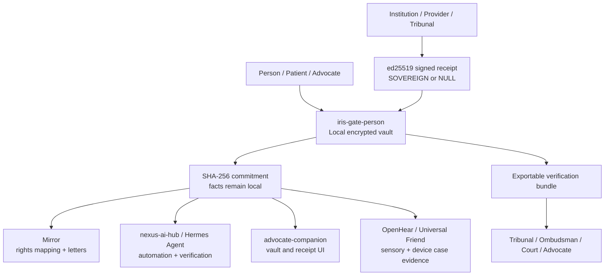
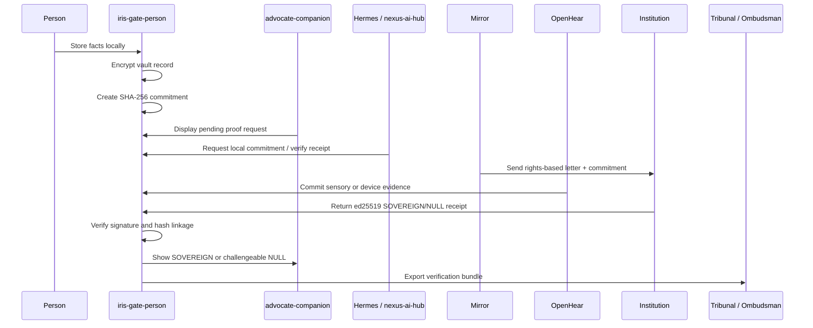

# @iris-gate/person — Ecosystem Stack v2

`@iris-gate/person` is the cryptographic sovereignty and verifiable proof layer for the Burgess Principle ecosystem. It gives a person a local-first vault for sensitive facts, creates one-way commitments over those facts, receives signed SOVEREIGN/NULL receipts from institutions or agents, and exports verification bundles that can be independently checked by tribunals, ombudsmen, courts, advocates, researchers, or trusted supporters.

The design goal is simple: **the person keeps the facts; the institution proves whether a human reviewed the specific case.**

---

## 1. Identity & Role in the Ecosystem

### What iris-gate-person is

`iris-gate-person` is a sovereign personal vault and proof engine. It is not a cloud case-management system, not an institutional CRM, and not a data broker. It is a local cryptographic layer that lets a person:

- Store sensitive case facts on their own device.
- Convert those facts into a one-way SHA-256 commitment.
- Send only the commitment to an institution, advocate, or ecosystem agent.
- Receive an ed25519-signed receipt declaring the outcome:
  - `SOVEREIGN` — a real human reviewed the specific case.
  - `NULL` — no human reviewed the specific case, or the case was automated, ignored, refused, or treated only as a category.
- Detect challengeable `NULL` outcomes.
- Export a complete, verifiable bundle for independent review.

The package is the personal-vault component of the wider Iris ecosystem and one of the most direct technical implementations of the Burgess Principle:

> **A human must review the specific case. Not the type of case. The actual case.**

### Position in the Burgess Principle stack

The ecosystem now contains several complementary layers:

- **Mirror** — institutional accountability, rights mapping, structured correspondence, and letter generation.
- **OpenHear** — sensory sovereignty, audio/haptic pipelines, Universal Friend support, sensory substitution, and patient-led assistive innovation.
- **nexus-ai-hub** — central intelligence layer, including Hermes Agent, MemPalace, OpenClaw Skills, and Advocate Companion intelligence.
- **advocate-companion** — user-facing advocacy interface for managing actions, evidence, correspondence, and support workflows.
- **iris-gate-person** — cryptographic proof, local vaulting, commitments, receipts, verification, and exportable sovereignty evidence.

`iris-gate-person` sits beneath and beside the rest of the stack as the proof substrate. Other projects may reason, assist, communicate, translate, or advocate; this project produces tamper-evident evidence that a particular case was either reviewed by a human or reduced to a `NULL` process.



### How it serves the other ecosystem layers

**Mirror** can use `iris-gate-person` to attach cryptographic proof to rights-based correspondence. A Mirror-generated letter can include a commitment ID, a request for a SOVEREIGN/NULL receipt, and later an export bundle showing whether the institution actually reviewed the specific facts.

**OpenHear** can use the vault for sensitive sensory, medical-device, accessibility, and patient-led innovation records. Audio/haptic logs, Universal Friend interaction summaries, sensory substitution settings, device failures, clinical correspondence, and biohacking observations can be committed without exposing raw private data.

**nexus-ai-hub / Hermes Agent** can automate commitment creation, receipt tracking, verification, escalation detection, and cross-tool reasoning while preserving zero-knowledge boundaries. Hermes should never need raw facts when a commitment, metadata envelope, or local verification result is enough.

**advocate-companion** can present the human-facing interface: vault status, pending receipts, challengeable `NULL` cases, bundle export, trusted contact workflows, and explanation layers for non-technical users.

---

## 2. Core Cryptographic Architecture (current state)

The current implementation uses standard, auditable primitives available through Node.js built-in `crypto`, with no external runtime dependencies.

### AES-256-GCM + PBKDF2-SHA256 vault

Sensitive vault records are encrypted for backup and restore using:

- **Cipher:** AES-256-GCM.
- **Key derivation:** PBKDF2-HMAC-SHA256.
- **Iteration count:** 200,000 iterations.
- **Salt:** random per encrypted vault.
- **IV:** random per encryption.
- **Authentication tag:** stored with the ciphertext.
- **Ciphertext encoding:** base64.

AES-GCM provides confidentiality and integrity: if ciphertext, IV, or authentication tag are modified, decryption fails. PBKDF2-SHA256 converts a passphrase into a 256-bit encryption key and slows offline guessing attacks. The current security level depends strongly on passphrase entropy; ecosystem clients should encourage long passphrases or platform-backed secrets.

Recommended vault envelope:

```json
{
  "algorithm": "aes-256-gcm",
  "kdf": "pbkdf2-sha256",
  "iterations": 200000,
  "salt": "hex",
  "iv": "hex",
  "authTag": "hex",
  "ciphertext": "base64",
  "version": 1
}
```

### SHA-256 commitment scheme

The commitment is a one-way fingerprint over canonicalized case facts plus a nonce. It allows the person to prove later that the facts existed in a specific form without disclosing those facts at the time of submission.

Current commitment fields:

```json
{
  "hash": "sha256-hex",
  "timestamp": "2026-05-03T21:24:56.993Z",
  "nonce": "random-hex",
  "version": 1
}
```

Security properties:

- **One-way disclosure boundary:** the institution receives the hash, not the underlying facts.
- **Preimage resistance:** SHA-256 makes it computationally infeasible to recover facts from the hash.
- **Nonce hardening:** random nonces protect predictable or low-entropy fact patterns from dictionary attacks.
- **Canonical reproducibility:** independent verifiers can recompute the hash from the exported facts and nonce.
- **Tamper evidence:** any change to facts, timestamp, nonce, or canonical encoding changes the hash.

Recommended v2 commitment envelope:

```json
{
  "type": "bp.commitment",
  "version": 2,
  "algorithm": "sha-256",
  "canonicalization": "json-c14n-v1",
  "hash": "hex",
  "nonce": "hex",
  "createdAt": "ISO-8601",
  "subjectRef": "local-only-or-pseudonymous-id",
  "tags": ["mirror", "openhear", "appeal"]
}
```

### ed25519 signed receipts (SOVEREIGN / NULL)

Receipts are institution- or agent-issued statements bound to a commitment hash. They are signed with ed25519 so that a verifier can detect tampering and attribute the receipt to a signing key.

Current receipt fields:

```json
{
  "commitmentHash": "sha256-hex",
  "outcome": "SOVEREIGN",
  "reason": "Human reviewer examined the specific case evidence.",
  "issuer": "Institution Name",
  "issuedAt": "2026-05-03T21:24:56.993Z",
  "signature": "ed25519-signature-hex",
  "issuerPublicKey": "ed25519-public-key-hex"
}
```

The receipt expresses the Burgess Principle test in a machine-verifiable form:

- `SOVEREIGN` means the issuer asserts that a human reviewed the actual case.
- `NULL` means the issuer admits or records that the specific case was not reviewed by a human.

Recommended v2 receipt envelope:

```json
{
  "type": "bp.receipt",
  "version": 2,
  "commitment": {
    "algorithm": "sha-256",
    "hash": "hex"
  },
  "outcome": "SOVEREIGN",
  "humanReview": {
    "required": true,
    "performed": true,
    "reviewerRole": "caseworker",
    "reviewedAt": "ISO-8601",
    "specificCaseReviewed": true
  },
  "issuer": {
    "id": "did:web:example.org",
    "name": "Institution Name",
    "publicKey": "ed25519-public-key-hex",
    "keyId": "did:web:example.org#bp-receipts-2026"
  },
  "issuedAt": "ISO-8601",
  "reason": "Plain-language explanation",
  "signature": {
    "algorithm": "ed25519",
    "value": "hex"
  }
}
```

### Challenge detection and verification logic

The current system identifies challengeable records by detecting receipts with `NULL` outcomes. A `NULL` receipt is not a technical failure; it is useful evidence. It says the institutional process did not satisfy the Burgess Principle for that specific case.

Verification checks should include:

1. Recompute the commitment hash from exported facts, nonce, and canonical encoding.
2. Confirm the recomputed hash equals the stored commitment hash.
3. Confirm the receipt references the same commitment hash.
4. Verify the ed25519 signature over the canonical receipt body.
5. Confirm the issuer public key is trusted, pinned, or resolved through an ecosystem trust registry.
6. Interpret the receipt outcome:
   - `SOVEREIGN` — accountability evidence.
   - `NULL` — challenge evidence.

### Exportable verification bundles

Export bundles are self-contained evidence packages for third parties. A tribunal should not need access to the user’s device, private vault key, or any central Iris service to verify a bundle.

Recommended bundle contents:

```json
{
  "type": "bp.exportBundle",
  "version": 2,
  "record": {
    "facts": {},
    "commitment": {},
    "receipt": {}
  },
  "verification": {
    "library": "@iris-gate/person",
    "libraryVersion": "1.0.0",
    "instructions": [],
    "createdAt": "ISO-8601"
  },
  "chainOfCustody": {
    "exportedBy": "person",
    "exportedAt": "ISO-8601",
    "redactions": []
  }
}
```

Future exports should support selective disclosure, redaction manifests, detached file hashes, and optional timestamp attestations while preserving the local-first privacy model.

---

## 3. Ecosystem Integration Architecture v2

Ecosystem Stack v2 treats `iris-gate-person` as a shared cryptographic layer with common data models, verification libraries, and trust semantics across Mirror, OpenHear, nexus-ai-hub, and advocate-companion.



### Mirror integration: rights-based evidence bundles

Mirror should use `iris-gate-person` commitments as evidence anchors in institutional correspondence.

Recommended pattern:

- Mirror maps the person’s issue to rights, duties, deadlines, and remedies.
- `iris-gate-person` creates a commitment for the sensitive case facts.
- Mirror includes the commitment hash and receipt request in the generated letter.
- The institution returns a signed SOVEREIGN/NULL receipt.
- Mirror links the receipt to the rights map and escalates if the outcome is `NULL`.
- The person exports a bundle containing:
  - rights map reference,
  - generated letter,
  - commitment,
  - receipt,
  - relevant facts or redacted facts,
  - verification instructions.

Recommended Mirror metadata:

```json
{
  "source": "mirror",
  "rightsMapId": "mirror-rights-map-id",
  "letterId": "mirror-letter-id",
  "jurisdiction": "UK",
  "institution": "issuer-or-respondent",
  "deadline": "ISO-8601"
}
```

### nexus-ai-hub / Hermes Agent integration: automated commitments and receipt verification

Hermes should act as an orchestration agent, not a custodian of private facts. Its default posture should be zero-knowledge: ask the local vault to create commitments and return verification results rather than ingesting raw case data.

Recommended integration points:

- **Commitment creation:** Hermes requests a local commitment for a selected case record.
- **Receipt polling:** Hermes monitors whether receipts have arrived or expired.
- **Receipt verification:** Hermes calls a shared verifier to check hash linkage, signature validity, and issuer trust.
- **Escalation:** Hermes flags `NULL` receipts for Mirror or advocate-companion workflows.
- **MemPalace linkage:** MemPalace stores non-sensitive references, summaries, and proof status, not raw vault facts by default.
- **OpenClaw Skills:** skills can operate on commitment metadata and verification results for drafting, summarizing, and routing.

Recommended local API boundary:

```json
{
  "request": "bp.createCommitment",
  "input": {
    "recordId": "local-record-id",
    "purpose": "institutional-review-request",
    "disclosure": "commitment-only"
  },
  "output": {
    "commitment": {},
    "localRecordRef": "opaque-local-reference"
  }
}
```

### advocate-companion integration: vault and receipt UI

`advocate-companion` should be the primary non-technical surface for the vault.

Recommended UI capabilities:

- Create and label vault records.
- Show which facts remain local and which commitments have been shared.
- Display pending, SOVEREIGN, NULL, expired, and unverifiable receipt states.
- Explain `NULL` as challenge evidence rather than user failure.
- Guide bundle export with redaction choices.
- Let trusted advocates verify bundles without gaining persistent access to the whole vault.
- Provide accessible explanations for neurodivergent users, disabled users, patients, carers, and non-specialist supporters.

Recommended receipt state machine:

```mermaid
stateDiagram-v2
  [*] --> Draft
  Draft --> Committed
  Committed --> PendingReceipt
  PendingReceipt --> Sovereign: valid SOVEREIGN receipt
  PendingReceipt --> Null: valid NULL receipt
  PendingReceipt --> Expired: deadline missed
  PendingReceipt --> Unverifiable: invalid signature or hash mismatch
  Null --> ChallengeReady
  Expired --> ChallengeReady
  Unverifiable --> ChallengeReady
  Sovereign --> AccountabilityLogged
```



### OpenHear integration: sensory and medical-device proof

OpenHear extends the Burgess Principle into sensory sovereignty: the right to have lived sensory experience, accessibility needs, device configurations, patient-led observations, and assistive experiments treated as specific evidence rather than generic categories.

`iris-gate-person` can anchor OpenHear evidence such as:

- sensory substitution configuration snapshots,
- Universal Friend interaction summaries,
- audio/haptic pipeline logs,
- medical-device events and failures,
- patient-led innovation notes,
- biohacking observations,
- accessibility accommodation requests,
- clinical correspondence and response receipts.

Recommended pattern:

- Raw sensory and medical data remains local or under user-selected storage.
- `iris-gate-person` commits canonical summaries, event manifests, or detached file hashes.
- Institutions receive only the commitment unless disclosure is explicitly chosen.
- Receipts prove whether the specific sensory/medical case was human-reviewed.
- Export bundles can include redacted summaries plus hashes for larger files.

Recommended detached file manifest:

```json
{
  "type": "bp.detachedEvidenceManifest",
  "version": 1,
  "files": [
    {
      "label": "OpenHear haptic session log",
      "mediaType": "application/json",
      "hashAlgorithm": "sha-256",
      "hash": "hex",
      "sizeBytes": 123456,
      "createdAt": "ISO-8601",
      "storage": "local"
    }
  ]
}
```

### Shared data models and cryptographic standards

All ecosystem projects should converge on a small set of stable proof objects:

- `bp.commitment`
- `bp.receipt`
- `bp.exportBundle`
- `bp.detachedEvidenceManifest`
- `bp.verificationResult`
- `bp.trustRegistryEntry`

Recommended standards:

- **Hashing:** SHA-256 for v1/v2 compatibility; reserve multihash support for future algorithms.
- **Signatures:** ed25519 for receipt signatures.
- **Canonicalization:** deterministic JSON canonicalization for every signed or hashed object.
- **Timestamps:** ISO-8601 UTC.
- **Encoding:** lowercase hex for hashes and signatures unless a future multibase profile is adopted.
- **Identifiers:** opaque local IDs by default; DID-compatible issuer IDs where appropriate.
- **Versioning:** explicit `type` and `version` fields on every portable object.
- **Privacy:** commitment-first exchange; raw facts are never sent by default.

### Proposed receipt verification protocol

Every ecosystem component should implement the same verification protocol:

1. **Parse** the receipt and commitment envelopes.
2. **Validate schema** by `type`, `version`, required fields, and allowed algorithms.
3. **Canonicalize** the receipt body excluding the signature value.
4. **Verify signature** using the issuer’s ed25519 public key.
5. **Recompute commitment** if facts or a disclosure package are present.
6. **Check binding** between receipt commitment hash and exported commitment hash.
7. **Resolve trust** by pinned key, local allowlist, DID document, or ecosystem trust registry.
8. **Evaluate outcome** as SOVEREIGN, NULL, expired, unverifiable, or disputed.
9. **Emit verification result** with machine-readable flags and plain-English explanation.

Recommended verification result:

```json
{
  "type": "bp.verificationResult",
  "version": 1,
  "signatureValid": true,
  "commitmentValid": true,
  "hashesMatch": true,
  "issuerTrusted": true,
  "outcome": "SOVEREIGN",
  "valid": true,
  "verifiedAt": "ISO-8601",
  "summary": "The receipt is valid and proves the issuer asserted human review of this specific case."
}
```

### Cross-project trust model

The trust model should be explicit and layered:

- **Local trust first:** the person can pin issuer keys directly.
- **Project trust registry:** ecosystem tools can ship or sync known public keys for institutions, advocacy organizations, and approved agents.
- **DID-compatible issuer identity:** institutions may publish public keys through `did:web` or equivalent mechanisms.
- **Key rotation records:** old keys should remain verifiable for historical receipts.
- **Revocation and dispute flags:** a receipt can be cryptographically valid but institutionally disputed, expired, or issued by an untrusted key.
- **No central dependency:** verification should still work offline when the relevant public key is included, pinned, or bundled.

---

## 4. Burgess Principle Cryptographic Enforcement

The current design directly implements the SOVEREIGN/NULL test by turning institutional accountability into a signed binary claim about a specific case.

### Current enforcement model

1. The person creates or imports case facts locally.
2. The vault creates a one-way commitment over those facts.
3. The institution receives only the commitment.
4. The institution must answer the actual question:
   - Did a human review this specific case?
5. The answer is signed as `SOVEREIGN` or `NULL`.
6. The person can prove the answer has not been altered.
7. A `NULL` receipt becomes challenge evidence.
8. A valid `SOVEREIGN` receipt creates an accountability trail.

This moves the evidential burden. The person no longer has to merely allege that automation or category-based handling occurred. They can present a receipt showing whether the institution cryptographically asserted human review of the specific committed case.

### Proposed enhancements

To strengthen cryptographic guarantees and auditability, Ecosystem Stack v2 should add:

- **Canonical JSON profile:** one deterministic encoding for commitments, receipts, manifests, and signatures.
- **Receipt schema registry:** versioned JSON Schemas for every portable proof object.
- **Detached signatures:** optional support for signed receipts that do not embed signatures inside the signed body.
- **Trusted timestamping:** optional RFC 3161, transparency log, or append-only ledger anchoring for receipt issuance and export events.
- **Selective disclosure:** redaction manifests proving which fields were withheld while preserving hash integrity.
- **Merkleized case records:** large case files can be represented as Merkle trees, allowing partial disclosure of individual facts or files.
- **Key rotation and revocation:** long-lived verification should survive institutional key changes.
- **Multi-party attestations:** advocates, clinicians, carers, or accessibility specialists can co-sign observations without becoming data controllers for the full vault.
- **Offline verifier:** a small standalone verifier for courts, ombudsmen, and support organizations.
- **Challenge packets:** standardized exports optimized for showing `NULL`, expiry, hash mismatch, or unverifiable issuer states.

---

## 5. Technical Roadmap

### Short term (1–3 months)

- Define `bp.commitment`, `bp.receipt`, `bp.exportBundle`, and `bp.verificationResult` JSON Schemas.
- Standardize receipt canonicalization and signature payload construction.
- Publish an ecosystem-wide TypeScript verification library shared by Mirror, nexus-ai-hub, advocate-companion, and OpenHear.
- Add explicit issuer trust states: pinned, trusted, unknown, revoked, and disputed.
- Add receipt expiry/deadline metadata for challenge workflows.
- Improve export bundles with schema version, library version, verification result, and redaction metadata.
- Document institutional receipt issuance requirements in plain English and technical form.

### Medium term (6–18 months)

- Integrate deeply with **nexus-ai-hub** so Hermes Agent can orchestrate commitment creation, receipt tracking, and escalation without centralizing raw facts.
- Integrate deeply with **Mirror** so rights-based letters include proof requests and exported bundles bind legal arguments to cryptographic receipts.
- Build **advocate-companion** vault management screens for non-technical users, carers, and advocates.
- Add OpenHear proof workflows for sensory substitution, Universal Friend interactions, audio/haptic logs, medical-device records, and patient-led innovation evidence.
- Release mobile companion support using platform keystores, biometric unlock where appropriate, and encrypted local backups.
- Add selective disclosure exports and detached evidence manifests for large medical, audio, haptic, or accessibility datasets.
- Provide standalone verifier packages for tribunals, ombudsmen, clinics, charities, and legal representatives.

### Long term

- Establish `iris-gate-person` as the universal proof layer for personal sovereignty across all Burgess Principle tools.
- Support cross-jurisdiction evidence bundles that can be verified offline and understood by non-technical decision makers.
- Add transparency and audit mechanisms that expose systemic `NULL` patterns without exposing personal facts.
- Enable patient-led and disabled-led innovation communities to prove institutional handling of specific lived experiences.
- Become a common cryptographic accountability protocol for human review, sensory sovereignty, accessibility justice, and AI-mediated public administration.

---

## 6. Technical Differentiators & Security Model

### Comparison to other systems

`iris-gate-person` overlaps with personal data vaults, verifiable credential wallets, evidence-management tools, and legal case systems, but it is distinct in purpose.

| System type | Typical goal | iris-gate-person difference |
| --- | --- | --- |
| Personal data vault | Store and sync user data | Adds commitments, signed review receipts, challenge detection, and tribunal-ready exports. |
| Verifiable credential wallet | Hold issuer claims about a subject | Focuses on proof that a specific case was or was not human-reviewed. |
| Legal case-management tool | Organize documents and deadlines | Provides cryptographic linkage between private facts, institutional response, and verification bundle. |
| Audit log | Record system events | Centers the person, keeps facts local, and makes institutional accountability portable. |
| Cloud advocacy platform | Coordinate support workflows | Defaults to local-first and zero-knowledge rather than centralizing sensitive facts. |

### Cryptographic assumptions

The current and proposed model assumes:

- SHA-256 remains preimage-resistant and collision-resistant for commitment use.
- ed25519 signatures remain unforgeable under standard assumptions.
- AES-256-GCM remains secure when used with unique IVs and authenticated tags.
- PBKDF2-SHA256 with sufficient iterations slows password guessing, but user passphrase strength remains critical.
- Canonicalization is deterministic and identical across implementations.
- Issuer public keys are correctly pinned, bundled, or resolved through trustworthy registries.
- Local devices may be hostile or compromised; high-risk users need platform keystores, backups, and operational-security guidance.

### Threat model

Primary threats:

- **Institutional denial:** an institution denies receiving or reviewing the specific case.
- **Receipt tampering:** a party alters a SOVEREIGN/NULL outcome, reason, issuer, or timestamp.
- **Hash substitution:** a receipt is attached to the wrong commitment.
- **Data over-disclosure:** advocacy workflows accidentally send raw facts when a commitment would suffice.
- **Weak passphrases:** encrypted vault backups are attacked offline.
- **Key confusion:** a valid signature is produced by an unknown, rotated, revoked, or impersonating key.
- **Metadata leakage:** labels, tags, timestamps, or filenames reveal sensitive information even when facts remain encrypted.
- **AI overreach:** agents ingest more personal data than required for the task.

Mitigations:

- Commitment-only exchange by default.
- Nonce-backed SHA-256 commitments.
- ed25519 signatures over canonical receipt bodies.
- AES-256-GCM authenticated vault encryption.
- Explicit issuer trust states and key pinning.
- Redaction-aware export bundles.
- Local verification before escalation.
- Human-readable verification summaries for courts and advocates.
- Zero-knowledge integration boundaries for Hermes, Mirror, OpenHear, and advocate-companion.

### Privacy guarantees

The intended privacy posture is:

- Raw facts stay local unless the person explicitly exports or discloses them.
- Commitments reveal no practical information about high-entropy or nonce-protected facts.
- Institutions can respond to a case without receiving the entire private vault.
- Ecosystem agents can operate on proof states rather than raw sensitive content.
- Export bundles are user-controlled, purpose-limited, and independently verifiable.

This is especially important for disabled people, patients, neurodivergent users, carers, biohackers, and patient-led innovators whose records may include medical, sensory, accessibility, financial, or institutional harm data.

---

## 7. North Star Vision

The North Star for `iris-gate-person` is to make human accountability verifiable at scale without forcing people to surrender their private lives to institutions or platforms.

In the mature Burgess Principle ecosystem:

- Mirror explains rights and generates institutional demands.
- OpenHear and Universal Friend capture lived sensory, accessibility, and device realities.
- nexus-ai-hub and Hermes Agent coordinate assistance, memory, and verification.
- advocate-companion gives people and supporters an accessible interface.
- `iris-gate-person` anchors the entire process in cryptographic proof.

The person should be able to say:

> “Here are my facts, disclosed only to the extent I choose. Here is the commitment proving those facts were fixed at the time. Here is the institution’s signed answer. Here is independent verification that the answer was SOVEREIGN or NULL.”

That is the technical heart of the Burgess Principle: not merely asking institutions to be accountable, but giving people portable, privacy-preserving, cryptographically verifiable evidence of whether accountability happened.

`iris-gate-person` should become the universal proof layer for personal sovereignty: a local-first, zero-knowledge, court-readable, ecosystem-wide protocol for proving that real human beings were seen, heard, and reviewed as specific cases rather than reduced to automated categories.
